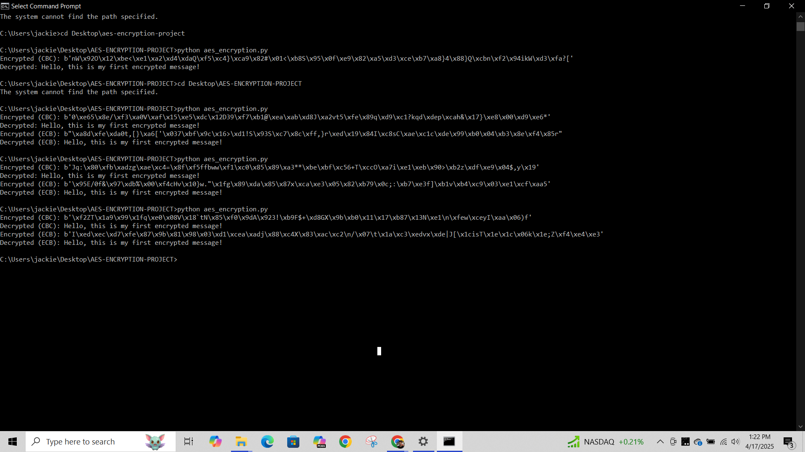

# AES Encryption in Python

This project demonstrates how to securely encrypt and decrypt messages using the Advanced Encryption Standard (AES) in Python. It compares both Cipher Block Chaining (CBC) and Electronic Codebook (ECB) modes, leveraging the `cryptography` library.

---

## Features
- AES-256 encryption using both CBC and ECB modes
- Random key and IV (Initialization Vector) generation
- Secure message encryption and decryption
- Error handling for incorrect key/IV usage
- Easy-to-follow code for learning purposes

---

## Requirements
- Python 3.x
- `cryptography` library

Install required package:
```bash
pip install cryptography
```

---

## How It Works
The script provides two encryption modes:
- **CBC (Cipher Block Chaining):** Adds randomness by combining plaintext blocks with previous ciphertext blocks.
- **ECB (Electronic Codebook):** Encrypts each plaintext block independently (less secure, used for educational comparison).

The user provides a plaintext message, and the script outputs:
- The encrypted ciphertext
- The decrypted original message

---

## Demo

Below is a screenshot showing the script successfully encrypting and decrypting a message using both AES modes:



---

## File Structure
| File | Description |
|:-----|:------------|
| `aes_encryption.py` | Python script for AES encryption and decryption |
| `cbcebc_encryption_output.PNG` | Screenshot showing successful encryption and decryption |
| `README.md` | Project overview and instructions |

---

## License
This project is provided for educational purposes only.

---

